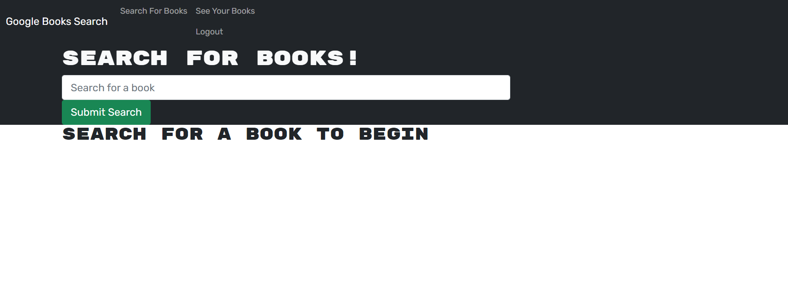

# 21-MERN-Book-Search-Engine

## User Story

```md
AS AN avid reader
I WANT to search for new books to read
SO THAT I can keep a list of books to purchase
```

## Tools

Using Mongoose, MongoDB, and express we build a database and load an application to allow a user to track workouts and store them to compare data.

## Functionality

Run 'npm i' then run 'npm run develop' to run the application.

## Example

A screenshot of the working application:



## Deployed

A link to the heroku application:

[Heroku](https://thawing-badlands-54607.herokuapp.com/)
